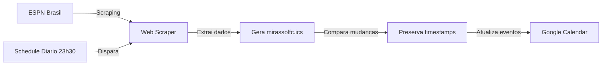

# 📅 Calendário Mirassol Futebol Clube 2026 – Jogos Sincronizados Automaticamente

Acompanhe o **calendário do Mirassol Futebol Clube 2026** com todas as datas, horários e resultados atualizados automaticamente.

Este projeto disponibiliza um **arquivo ICS sincronizado diariamente** com os dados dos jogos do Mirassol FC, pronto para integrar ao **Google Calendar, Apple Calendar, Outlook e outros aplicativos de agenda**.

⚽ **Ideal para quem busca:**

- Jogos do Mirassol hoje
- Próximos jogos do Mirassol
- Tabela e calendário atualizado
- Integração com Google Calendar
- Agenda do Mirassol comod: 2026

---

## 🎯 O Que É Este Projeto?

O **Calendário Mirassol Futebol Clube** é uma ferramenta **automatizada e open-source** que:

✅ Consulta automaticamente o ESPN Brasil todo dia às 23h30 (Brasília)
✅ Gera um calendário `.ics` com todos os jogos do Mirassol
✅ Sincroniza resultados e próximas partidas em tempo real
✅ Atualiza apenas eventos que sofreram mudanças (preserva timestamps)
✅ Integra com Google Calendar e outros aplicativos
✅ Funciona com múltiplos campeonatos do clube

Você nunca mais precisa pesquisar manualmente pelos jogos do Mirassol.

---

## 📌 Adicionar Calendário ao Google Calendar

Clique no botão abaixo para adicionar o calendário do Mirassol Futebol Clube ao seu Google Calendar:

👉 **[Adicionar Calendário do Mirassol FC](https://calendar.google.com/calendar/u/0/embed?src=30bc3a6642986d5fd6c8b3126783ebee29c20171d7089f11fe6904697b1df244@group.calendar.google.com)**

Após adicionar, os eventos aparecerão automaticamente em sua agenda com:

- Datas oficiais dos jogos
- Horários atualizados
- Confrontos (Mirassol vs Adversário)
- Competição/Campeonato
- Resultados (quando finalizados)

---

## 📊 Conteúdo do Calendário

O calendário inclui jogos de:

- **Campeonato Brasileiro** (Série A)
- **Campeonato Paulista**
- **Copa do Brasil**
- **Outras competições oficiais**

Os dados são **atualizados diariamente** de forma automática via GitHub Actions.

---

## ⚙️ Como Funciona a Automação

---

## 📊 Estatísticas de Uso

Última atualização: **20/02/2026 às 14:34** (Brasília)

- 👥 **Usuários diretos:** 3
- 👨‍💼 **Grupos:** 0
- 🏢 **Domínios:** 0
- 🌐 **Acesso público:** Sim ✅
- 📈 **Total de entradas de acesso:** 4

---



**Cronograma:**

- ⏰ Executa automaticamente às **23h30 (horário de Brasília)**
- 🔄 Todos os dias
- 📤 Atualiza Google Calendar com novos dados
- 💾 Faz commit apenas de mudanças reais

---

## 🛠️ Como Usar Localmente

Se você quer rodar o projeto manualmente:

### 1️⃣ Clonar o repositório

```bash
git clone https://github.com/rafaelberrocalj/calendario-mirassolfc
cd calendario-mirassolfc
```

### 2️⃣ Instalar dependências

```bash
pip install -r requirements.txt
```

### 3️⃣ Executar o scraper

```bash
./run.sh scrape
```

Isso gerará/atualizará o arquivo `mirassolfc.ics`.

### 4️⃣ Comandos disponíveis

```bash
./run.sh scrape              # Executa web scraper
./run.sh list                # Lista calendários
./run.sh create <nome>       # Cria novo calendário
./run.sh update              # Sincroniza com Google Calendar
./run.sh share <email>       # Compartilha calendário
./run.sh delete <id>         # Deleta calendário
./run.sh info <id>           # Informações do calendário
```

---

## 📂 Estrutura do Projeto

```
calendario-mirassolfc/
├── .github/workflows/
│   └── sync-google-calendar.yml    # Automação GitHub Actions
├── scraper.py                      # Web scraper do ESPN Brasil
├── calendar_cli.py                 # Interface de linha de comando
├── calendar_utils.py               # Funções auxiliares
├── mirassolfc.ics                  # Arquivo calendário gerado
├── run.sh                          # Script de execução
├── requirements.txt                # Dependências Python
└── README.md                       # Este arquivo
```

---

## 🔑 Principais Características

### 🔄 Sincronização Inteligente

- Detecta automaticamente mudanças nos dados dos jogos
- Preserva timestamps de eventos não alterados
- Reduz commits desnecessários no Git
- Atualiza Google Calendar apenas quando há mudanças reais

### 🌐 Multi-Plataforma

- Google Calendar
- Apple Calendar (iCloud)
- Outlook
- Mozilla Thunderbird
- Qualquer aplicativo que suporte .ics

### 🔐 Segurança

- Credenciais armazenadas em GitHub Secrets
- Chaves de autenticação removidas após execução
- Arquivo `.ics` público para compartilhamento

### ⚡ Performance

- Retry automático com backoff exponencial
- Cache inteligente para evitar bloqueios
- Parsing otimizado de dados

---

## 📋 Tecnologias Utilizadas

- **Python 3.12** - Linguagem principal
- **BeautifulSoup4** - Web scraping
- **Requests** - HTTP client
- **iCalendar** - Geração de arquivos .ics
- **Google Calendar API** - Integração com Google
- **GitHub Actions** - Automação CI/CD

---

## 🚀 Configuração de Automação

O projeto utiliza **GitHub Actions** para automação contínua:

**Arquivo:** `.github/workflows/sync-google-calendar.yml`

**Comportamento:**

- ✅ Executa todo dia às **23h30 (Brasília)** = 2h30 UTC
- ✅ Pode ser disparado manualmente via `workflow_dispatch`
- ✅ Scrapa dados do ESPN Brasil
- ✅ Sincroniza com Google Calendar
- ✅ Faz commit automático de mudanças

**Para usar:**

1. Configure a secrets `SERVICE_ACCOUNT_KEY` no repositório com suas credenciais Google
2. A automação rodará automaticamente todos os dias às 23h30

---

## 💡 Por Que Usar Este Calendário?

✔️ **Atualizado automaticamente** - Sem necessidade de atualizar manualmente
✔️ **Dados precisos** - Retirados diretamente do ESPN Brasil
✔️ **Multi-plataforma** - Funciona em qualquer calendário que suporte .ics
✔️ **Otimizado** - Só atualiza o que mudou realmente
✔️ **Open-source** - Código aberto para contribuições
✔️ **Rastreável** - Histórico completo no Git

---

## 🤝 Contribuir

Quer melhorar o projeto? Sua contribuição é bem-vinda!

1. Faça um **fork** do repositório
2. Crie uma **branch** para sua feature (`git checkout -b feature/melhoria`)
3. Faça **commit** das mudanças (`git commit -m 'Adiciona melhoria'`)
4. Faça **push** para a branch (`git push origin feature/melhoria`)
5. Abra um **Pull Request**

Sugestões também podem ser abertas como Issues.

---

## 📝 Licença

Este projeto está disponível sob licença open-source.

---

## 🔍 Keywords SEO

calendário Mirassol Futebol Clube 2026 • jogos do Mirassol hoje • tabela Mirassol • agenda Mirassol Google Calendar • arquivo ICS Mirassol • próximos jogos do Mirassol • Mirassol Futebol Clube calendário • jogos Mirassol 2026 • resultados Mirassol • Mirassol vs Palmeiras • Mirassol vs Santos
